# Instrument Sans

> A variable sans-serif designed for the [Instrument](https://instrument.com) brand, and open-sourced for you on [google fonts](https://fonts.google.com/specimen/Instrument+Sans/glyphs).

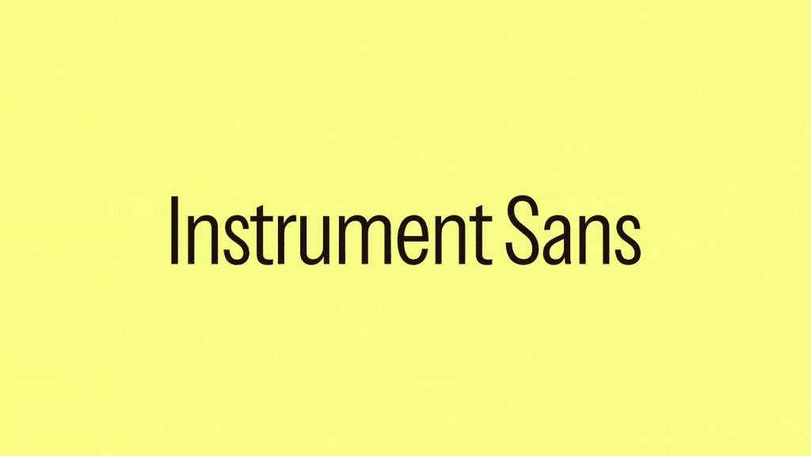

## Description

Instrument Sans is a variable sans-serif which balances an abundance of precision with subtle notes of playfulness. Inspiration was drawn from [our](https://instrument.com) enduring interest in neo-grotesques. In a way, this family of weights, widths, and italics represent an orchestration of all of our favorite qualities in a sans-serif while featuring contemporary characteristics that make this typeface distinctly our own.

Featuring 12 unique stylistic sets, commonly-used characters can be replaced with alternate glyphs in a variety of combinations to tailor the appearance and legibility of messaging. This flexibility allows for a wide range of expressive styles, making it easy to mold it to perfectly suit whatever style of expression is needed.

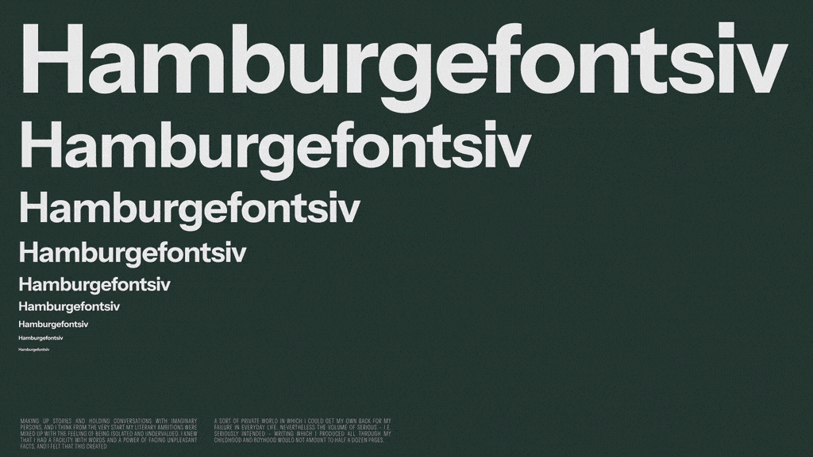

## Variable Axes

| Axis Name | Description  | Range   |
| --------- | ------------ | ------- |
| `wdth`    | Width        | 75-100  |
| `wdth`    | Weight       | 400-700 |
| `ital`    | Italic Slant | 0-100   |

## Opentype Features

### Stylistic Sets:

| Example                 | Set Name | Description                                      |
| ----------------------- | -------- | ------------------------------------------------ |
| 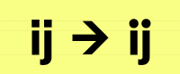  | `SS01`   | Round punctuation, tittles, and diacritics       |
| 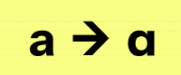  | `SS02`   | Alternate “a” with single-story constructions    |
| 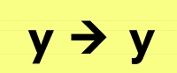  | `SS03`   | Alternate “y” with a rounded descender           |
| 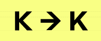  | `SS04`   | Alternate “K” with a crossed arm and leg         |
| 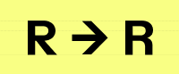  | `SS05`   | Alternate “R” with a straight leg                |
| 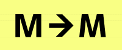  | `SS06`   | Alternate “M” with angled strokes                |
| 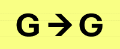  | `SS07`   | Alternate “G” without the spur                   |
| 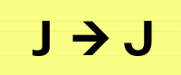  | `SS08`   | Alternate “J” with extended terminal             |
| 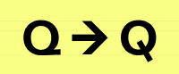  | `SS09`   | Alternate “Q” with alternate tail                |
| 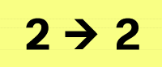 | `SS10`   | Alternate “2” with alternate spine               |
| 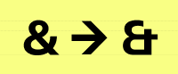 | `SS11`   | Alternate “&” (’Et’ style ampersand)             |
| 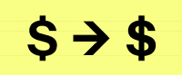 | `SS12`   | Alternate “$” and “¢” with solid vertical stroke |

### Other features:

- `aalt` - Access all alternatives
- `case` - Case-sensitive punctuation
- `liga` - Standard ligatures
- `pnum` - Proportional Figures
- `tnum` - Tabular Figures

## Language support

Instrument Sans supports 389 languages.

## Acknowledgements

Designed by [Rodrigo Fuenzalida](https://rfuenzalida.com) with direction from [Jordan Egstad](https://egstad.com).

## License

This Font Software is licensed under the SIL Open Font License, Version 1.1. This license is available with a FAQ at: https://scripts.sil.org/OFL
